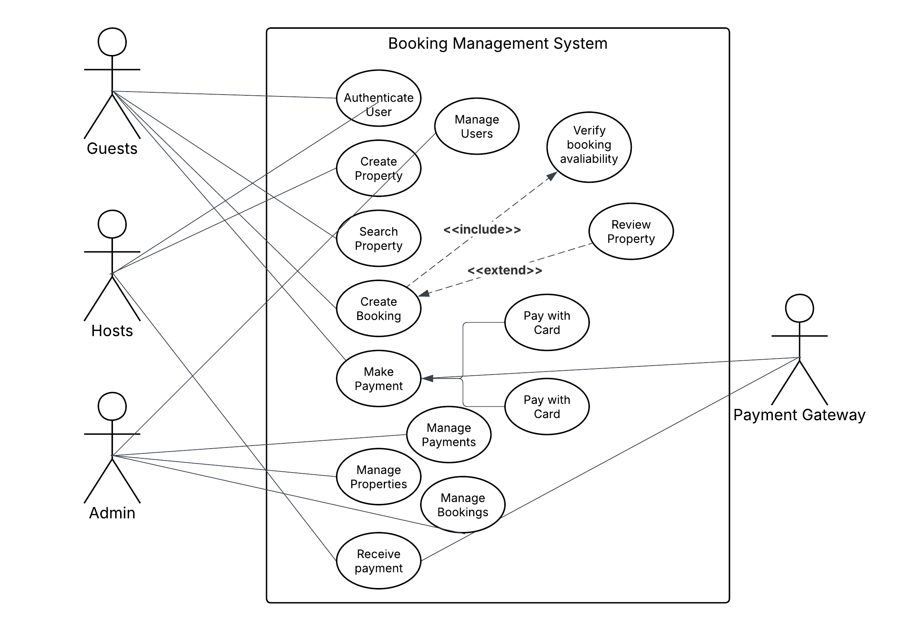

# Requirement Analysis in Software Development.
A comprehensive overview of the Requirement Analysis phase, the first and most critical step in the Software Development Life Cycle (SDLC). This project explores the process of gathering, analyzing, and documenting software requirements to ensure clear understanding between stakeholders and developers

## What is Requirement Analysis?
Requirement Analysis is a **crucial** process in the SDLC where a project team gathers, analyses and defines the requirements of software to be developed. It is termed **crucial** because it is the first step in the SDLC. A well-executed requirement analysis prevents expensive errors down the line. When the foundation is weak or misaligned, every subsequent step in development is at risk of collapsing.

## Why is Requirement Analysis Important?
1. **Clarity and Understanding**: It helps in understanding what the stakeholders expect from the software, reducing ambiguity.
2. **Scope Definition**: Clearly defines the scope of the project, which helps in preventing scope creep.
3. **Basis for Design Development**: Provides a solid foundation for designing and developing the system.
4. **Cost and Time Estimation**: Facilitates accurate estimation of project cost, resources, and time.
5. **Quality Assurance**: Ensures that the final product meets the specified requirements, leading to higher customer satisfaction.

## Key Activities in Requirement Analysis.
### 1. Requirement Gathering
This is the first phase in the requirement analysis process. It involves identifying stakeholders (the owners of the product and intended users of the product) and engaging with them in order to collect initial requirements for the project. This is usually acheived through one or more of the following processes:

- **Interviews**: Conducting interviews with stakeholders to gather detailed information about their needs and expectations.  
- **Surveys/Questionnaires**: Distributing surveys to collect requirements from a larger audience.  
- **Workshops**: Organizing workshops with stakeholders to discuss and gather requirements.  
- **Observation**: Observing end-users in their working environment to understand their needs.  
- **Document Analysis**: Reviewing existing documentation and systems to understand current functionalities and requirements.

### 2. Requirement Elicitation
This is the second phase in the requirement analysis process. It involves refining, improvement and elaboration on the gathered requirements. This phase implements the following techniques:

- **Brainstorming**: Conducting brainstorming sessions to generate ideas and gather requirements.  
- **Focus Groups**: Holding focus group discussions with selected stakeholders to gather detailed requirements.  
- **Prototyping**: Creating prototypes to help stakeholders visualize the system and refine their requirements.  

### 3. Requirement Documentation
This phase involves recording/documenting requirements in a detailed and structured format. Some of the products of this phase include requirement specification documents, user stories, and use cases.

- **Requirement Specification Document**: Creating a detailed document that lists all functional and non-functional requirements.  
- **User Stories**: Writing user stories to describe functionalities from the user’s perspective.  
- **Use Cases**: Creating use case diagrams to show interactions between users and the system.  

### 4. Requirement Analysis and Modelling
This phase involves analysis and prioritization of requirements. The goal here is to finalize a set of requirements that is achievable and aligns with the overall objectives of the project. During this process, various models and diagrams are usually created to aid in visualization and analysis of the requirements. The processes involved are explained below:

- **Requirement Prioritization**: Prioritizing requirements based on their importance and impact on the project.  
- **Feasibility Analysis**: Assessing the feasibility of requirements in terms of technical, financial, and time constraints.  
- **Modeling**: Creating models (e.g., data flow diagrams, entity-relationship diagrams) to visualize and analyze requirements.  

### 5. Requirement Validation and Verification
This phase involves reviewing and validating the requirements with stakeholders. Validation involves confirming that the requirements actually meet the needs of the stakeholders and the goals of the project while Verificaion is about making sure that the requirements are documented correctly and consistently.

## Types of Requirements.
### Functional Requirements
**Definition:** Describe what the system should do.  
**Examples:** User authentication, property search, booking system, user registration.  

#### Key Functional Requirements
- **Search Properties**: Users should be able to search for properties based on various criteria such as location, price, and availability.  
- **User Registration**: New users should be able to create an account with personal details and login credentials.  
- **Property Listings**: Display properties with essential details and images.  
- **Booking System**: Users should be able to book properties, view booking details, and manage their bookings.  
- **User Authentication**: Secure login and registration process for users.  

### Non-functional Requirements

**Definition:** Describe how the system should perform.  
**Examples:** Performance, security, scalability, usability, reliability.  

#### Key Non-functional Requirements
- **Performance**: The system should load pages within 2 seconds and handle up to 1000 concurrent users.  
- **Security**: Ensure data encryption, secure login, and protect against common vulnerabilities.  
- **Scalability**: The system should be able to scale horizontally to handle increased traffic.  
- **Usability**: The application should have an intuitive UI/UX, making it easy for users to navigate and perform tasks.  
- **Reliability**: The system should have an uptime of 99.9% and recover quickly from any failures.

#### Example
Acceptance criteria for a checkout feature in an apartment booking management system can be:
- User can select an available room from the listings.
- User can choose a payment method: card, bank transfer, or cryptocurrency.
- Payment is processed successfully without errors.
- After successful payment, the system redirects the user to a confirmation/success page.
- The success page displays booking details (room, dates, payment confirmation).

## Use Case Diagrams
Use case diagrams show how different users (actors) interact with the system to achieve specific goals (use cases).

### Benefits of Use Case Diagram
- Provide a clear visual representation of system functionalities.
- Help in identifying and organizing system requirements.
- Facilitate communication among stakeholders and development team.

### Sample Use Case Diagram for Appartment Booking System 

## Acceptance Criteria
Acceptance criteria are conditions that a feature must meet for acceptance by a stakeholder. 
### Why is Acceptance Criteria Important in Requirement Analysis
- It ensure's all parties have a clear understanding of feature requirements.
- It provides a basis for testing and validation.
- It helps in maintaining quality and meeting user expectations.
